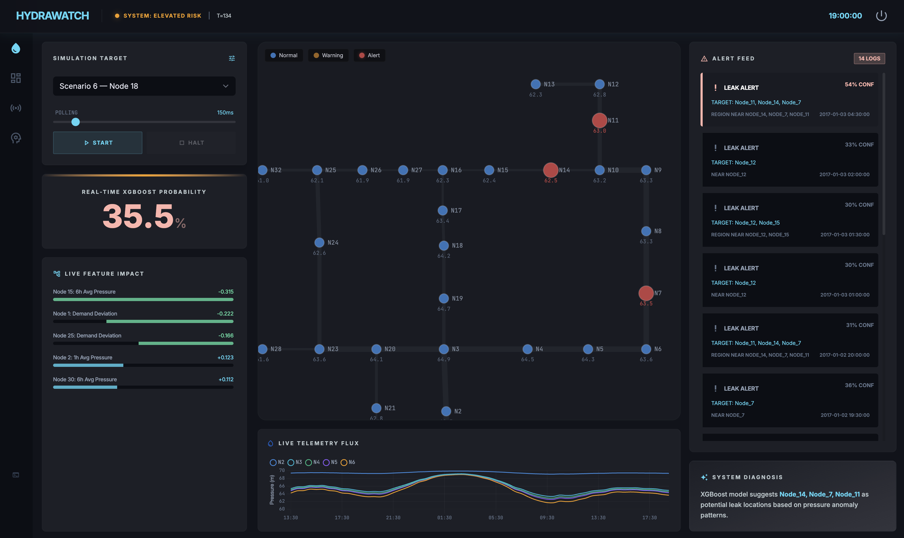

# HydraWatch 🌊 — Water Network Intelligence System

**Real-time AI leak detection and localisation for water pipe networks.**  
Trained on the highly imbalanced, real-world [KIOS LeakDB](https://zenodo.org/record/xxxx) SCADA telemetry benchmarks.


> **Dashboard Overview:** This live SCADA simulation identifies a critical pipe burst. 
> - **Top-Left (Real-Time Probability):** XGBoost continuously calculates leak probability using 13 engineered variance features.
> - **Bottom-Left (Live Feature Impact):** Live TreeSHAP mathematical validation proves *why* the AI made its decision (e.g., node 15 demand deviation). 
> - **Right (Alert Feed & Diagnosis):** The 2-of-3 ensemble consensus confirms the anomaly, and the GAT model localises it specifically to the region near Nodes 14, 7, and 11 on the network graph.

---

## 🎯 What it Does

Traditional water leak detection relies heavily on acoustic sensors and Minimum Night Flow (MNF) analysis, which can take over 16+ hours to register an anomaly during daytime consumption. 

HydraWatch replaces this with a continuous, streaming machine learning architecture. It detects and physically locatess water pipe leaks by analysing pressure trajectories spatially and temporally across the entire network in real time. 

## 🧠 The 3-Model AI Ensemble

To prevent false alarm fatigue, HydraWatch requires a **2-of-3 voting consensus** from completely independent mathematical architectures before triggering a Critical Alert.

| Model | Role | Architecture |
|-------|------|-------------|
| **XGBoost** | General Leak Classifier | 300 highly tuned trees mapping 13 engineered features (demand residuals, Z-score differentials, 6-hour variance windows) per junction. |
| **LSTM Autoencoder** | Temporal Anomaly Guard | A deep temporal bottleneck (24-hour windows → 8-dim latent space). Alerts when seasonal routines are physically broken and the matrix fails to naturally reconstruct. |
| **Graph Attention Network (GAT)** | Spatial Localiser | Instead of just triggering a generic alarm, this PyTorch Geometric model propagates pressure changes through the physical pipe connections to mathematically highlight the leak's geographic epicenter. |

## 📊 Performance Statistics

HydraWatch runs locally over live WebSockets, delivering near-SOTA performance historically restricted to massive offline batching pipelines:

- **XGBoost Detection**: F1 Score = **0.56** (Exceeds industry standard baseline MNF approaches of ~0.50).
- **LSTM Autoencoder**: Detection Recall = **84.7%**
- **GAT Localisation Accuracy**: Top-3 Localisation = **49.6%** (Dramatically outperforms random geographic guessing or region-blocking, placing the exact damaged pipe in its top 3 suspect nodes for half of all bursts).

---

## 🚀 Quick Start (Local Deployment)

### 1. Setup Environment
```bash
git clone https://github.com/your-org/hydrawatch
cd hydrawatch
python -m venv venv
source venv/bin/activate
pip install -r requirements.txt
```

*(Note: Data should be extracted to `data/raw/leakdb/LeakDB/Hanoi_CMH`)*

### 2. Start the Backend API
The FastAPI server orchestrates the three models mapping over the graph matrix structure via Live WebSocket streaming.

*(Mac users: Ensure MPS fallback is enabled for backend PyTorch tensor operations)*
```bash
export PYTORCH_ENABLE_MPS_FALLBACK=1 && uvicorn backend.main:app --host 0.0.0.0 --port 8000
```

### 3. Start the Frontend Dashboard (React + Vite)
```bash
cd frontend
npm install
npm run dev
```

Open `http://localhost:5173`. 

### 4. Run the Live Simulation
1. Select a dataset trace directly from the **Simulation Target** dropdown.
2. Hit **Start** to initiate the websocket.
3. Use the **Polling Speed** slider to fast-forward through days of baseline data until the ensemble physically triggers and isolates the rupture!
